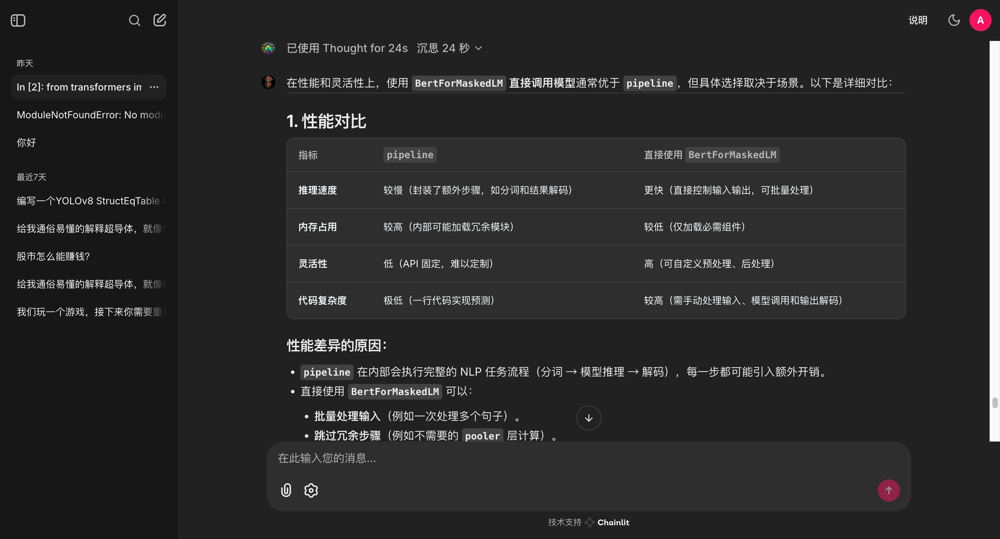

# Chainlit 聊天应用

一个基于 Chainlit 构建的智能聊天应用模版，支持多个大语言模型，提供流畅的对话体验。



## 功能特点

- 🤖 支持配置多个大语言模型接口(\<think\> \</think\>或reasoning_content)
  - DeepSeek
  - QWQ
- 💬 流畅的对话界面
- 🔒 内置身份验证系统
- 💾 对话历史记录保存

## 环境要求

- Python 3.11+
- Node.js (用于前端资源)

## 快速开始

1. 克隆项目

```bash
git clone <项目地址>
cd chat
```

2. 安装依赖

```bash
pip install -r requirements.txt
```

3. 配置环境变量

复制 `.env.example` 文件并重命名为 `.env`，然后填入相应的配置：

```env
CHAINLIT_AUTH_SECRET="your_auth_secret_here"
DEEP_SEEK_API_KEY="your_deepseek_api_key_here"
QWQ_API_KEY="your_qwq_api_key_here"
API_BASE_URL="http://localhost:8080"
```

4. 启动应用

```bash
chainlit run main.py
```

访问 `http://localhost:8000` 即可使用应用

## 项目结构

```
├── main.py              # 主程序入口
├── config/              # 配置文件目录
├── utils/               # 工具函数
├── public/              # 静态资源
└── chainlit.md         # 欢迎页面配置
```

## 自定义配置

- 修改 `config/chat_settings.py` 可以自定义聊天参数
- 编辑 `chainlit.md` 可以自定义欢迎页面内容
- 在 `public/` 目录下可以替换界面图标和样式

## 贡献指南

欢迎提交 Issue 和 Pull Request 来帮助改进项目。

## 许可证

MIT License